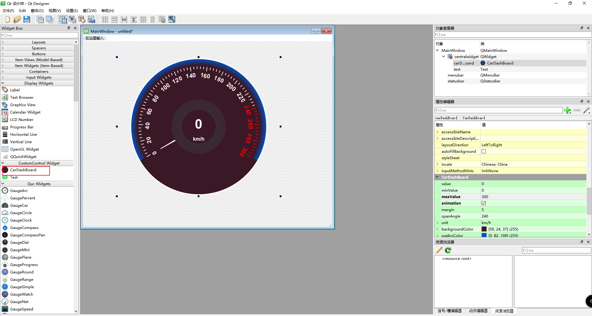
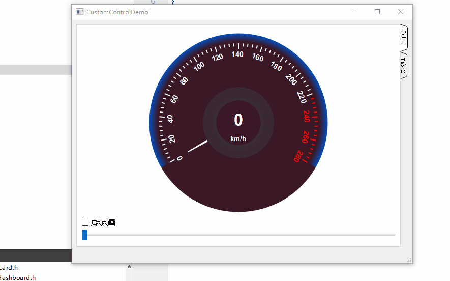

# CustomControl

​	自定义控件库，生成dll文件后复制到对应的qt设计师文件路径，可用qt设计是查看效果，同时可以使用头文件与dll文件在项目中使用。

* ## CarDashBoard

​	自定义汽车仪表盘控件，效果图如下

* ## Test 

###### 	测试控件，在新增控件是可直接复制该目录，同时复制对应的testplugin.h/testplugin.cpp文件进行修改

# CustomControlDemo

 自定义控件使用Demo, 以添加项目，类提升的方式调用自定义控件进行使用

* ### CarDashBoard使用效果

